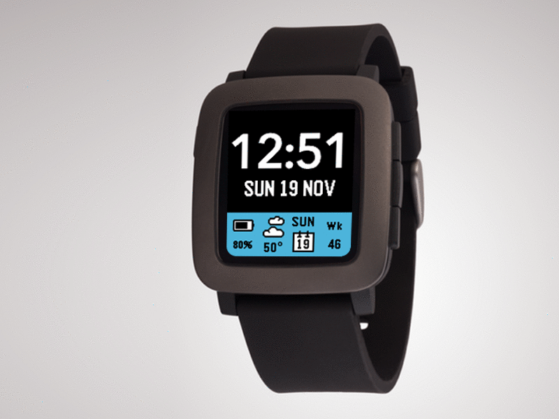
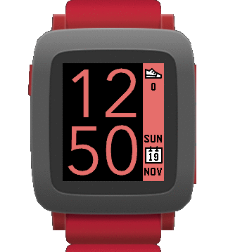
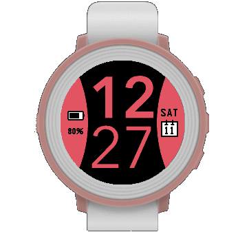

# TimeStyleBB
A stylish, modern watchface for the Pebble and Pebble Time watches.

This project is a fork of [freakified/TimeStylePebble](https://github.com/freakified/TimeStylePebble).
In addition to the original version this version add various corrections and a bottom/top bar possibility that can display up to four widgets.

Inspired by the visual language of the Timeline found on the Pebble Time, TimeStyle is designed as the “present” to complement the Timeline’s “past” and “future”.

* Readable: With more than 80% of the display area devoted to the time and 6 font options, TimeStyle is designed for readability in all conditions. Unlike most other Pebble faces, time text is displayed using antialiasing, achieved using palette swapping.
* Colorful: includes over 20 preset color schemes, and also supports custom colors using any color the Pebble Time can display&mdash;also supports saving, loading, and sharing custom presets!
* Configurable: TimeStyle features a wide variety of different complications, including step counts, sleep times, weather forecasts, the week number, seconds, the time in another time zone, the battery level, and more.
* Keeps you informed: TimeStyle automatically displays notifications when the battery is low or when your phone disconnects.
* Works in 30 different languages, more than any other Pebble face: English, French, German, Spanish, Italian, Dutch, Turkish, Czech, Slovak, Portuguese, Greek, Swedish, Polish, Romanian, Vietnamese, Catalan, Norwegian, Russian, Estonian, Basque, Finnish, Danish, Lithuanian, Slovenian, Hungarian, Croatian, Serbian, Irish, Latviann, and Ukrainian.

## Want to try it?
* Download on the Pebble store at the link below: https://apps.rebble.io/en_US/application/5a48b54f0dfc32823d0041d5?query=timestylr&section=watchfaces
* Or download the lastest PBW package here: https://github.com/plarus/TimeStyleBBPebble/releases

## Issues
You have found an issue? You can report it here: https://github.com/plarus/TimeStyleBBPebble/issues/new

## Contributing
Want to contribute to TimeStyle? Have a look at [the various feature requests that are still outstanding](https://github.com/freakified/TimeStylePebble/issues?q=is%3Aopen+is%3Aissue) -- just comment on one if you're interested in working on it!

## Gallery
  
